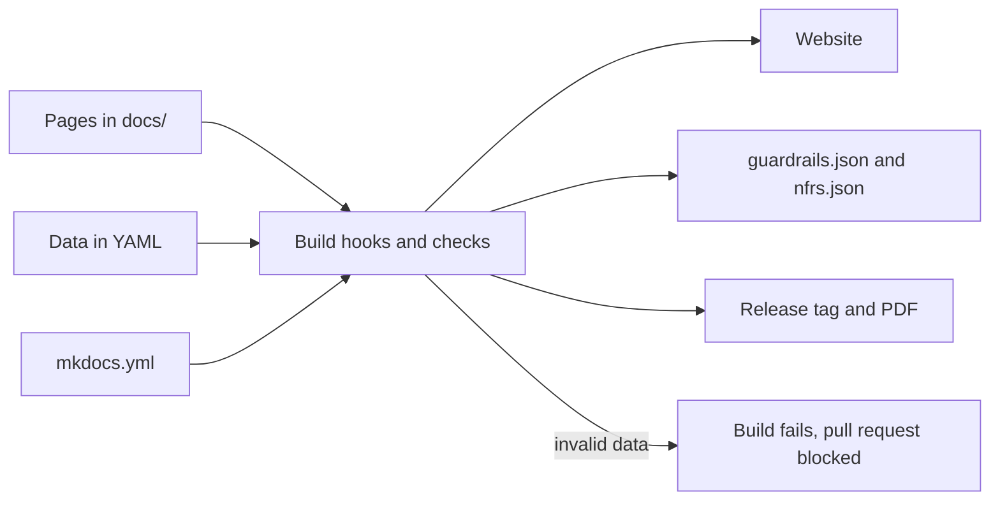

# Updating the Defra architecture site: a guide for the team

Start here if you are new to updating this site. It explains how the site is built, the rules every change follows, which file to edit for each kind of change and how a change gets published.

For the exact fields, templates and commands, use the [contribute](index.md) page. This guide gives you the overview.

## How the site is built

The site is generated from Markdown and YAML files in the [DEFRA/architecture](https://github.com/DEFRA/architecture) repository. Nobody edits HTML. Every change goes through a pull request, is checked automatically, and is published when it is merged to `main`.

- **MkDocs with the Material theme.** Settings and the navigation are in `mkdocs.yml`. A new page does not appear in the navigation until you add it there.
- **Pages are Markdown with front matter.** Each guardrail page holds its guardrails as text (heading, Must, Should or Could badge, why and how to meet it) and their metadata as YAML at the top of the file: phases, lead roles, evidence, and links to the Service Standard, the Technology Code of Practice (TCoP) and Secure by Design.
- **Data is YAML.** Capabilities, non-functional requirements (NFRs), service tiers, the delivery lifecycle, platforms, roles, approvals and exceptions are YAML files, not pages. Pages show them through markers such as `<!-- guardrails:library -->`.
- **Build hooks check and generate.** Small Python scripts in `hooks/` read the YAML and front matter, check it and generate the guardrail library, traceability tables, open questions list, draft banners and abbreviation tooltips. If the data is wrong, the build fails with a message saying what to fix.
- **Machine-readable outputs.** Every build publishes `guardrails.json` and `nfrs.json`. Every release also gets a version tag and a PDF of every guardrail, so contracts can cite a fixed version.

You change words in `docs/` and values in the YAML files. You almost never need to touch `hooks/`, `overrides/` or the stylesheets.

## Rules every change follows

Most of these are enforced by the build, so breaking one fails the pull request rather than reaching the site.

| Rule | What it means in practice | Checked by |
| --- | --- | --- |
| Ids are permanent | Never renumber, rename, reuse or delete a guardrail, principle, doctrine or NFR id, because contracts cite them. To retire one, set `status: deprecated` and `replaced_by:`. A new one takes the next free number in its area and starts as `status: draft`. | Build and tests |
| Never guess a Defra fact | Names, mailboxes, web addresses, lead times, approvals and owners come from someone who knows. If you do not know, add a "To be confirmed" box. It appears on the [open questions](../about/open-questions.md) page automatically. | Review |
| Musts only where required | A Must needs a legal, policy or security reason, evidence for each phase, review by the Technical Design Authority and approval by the Technology Governance Board. Use Should by default. | Tests limit the number of Musts |
| Link, do not repeat | Step-by-step tasks, contacts and team processes belong in the [Defra Digital Service Manual](https://digital.defra.gov.uk/). Guardrails, decisions and evidence belong here. See [where things live](where-things-live.md). | Matching links test |
| GOV.UK style | Plain English, active voice, sentence case headings. Lead with what the team must do and explain why. Expand abbreviations the first time you use them. See [content style](content-style.md). | Prose checks (warnings) |
| Accessible | WCAG 2.2 AA in light and dark mode. Every diagram needs `accTitle` and `accDescr`. Link text says where the link goes. | Accessibility test and tests |
| Public repository | No secrets, internal hostnames, IP addresses, personal data, commercially sensitive detail or detailed security weaknesses. | Review |
| Record every change | Add a line under `## [Unreleased]` in `CHANGELOG.md` and update [what's new](../about/changelog.md). | Review |

Edit the YAML or front matter, never the generated output. Keep each pull request to one change so it can be reviewed quickly.

## Which file to edit

The [common tasks](index.md#common-tasks) on the contribute page give the exact fields and templates for each of these.

| To | Edit | Watch out for |
| --- | --- | --- |
| Fix wording on any page | The page in `docs/`, or select **Edit this page** on the site | Nothing else - a small pull request is fine |
| Reword a guardrail | Its section in `docs/guardrails/` | Keep the heading shape `## GR-HOST-01 Title {#gr-host-01}` and the badge at the start of the first line. Changing what a Must asks for needs the `must-change` label. |
| Add a guardrail | Heading, badge, why and how to meet it in the page, and a `guardrails:` entry in the front matter | Next free id, `status: draft`, `lead_roles`, and for a Must `evidence` and `evidence_by_phase` for every phase |
| Retire a guardrail | Its metadata: `status: deprecated` and `replaced_by:` | Leave the section on the page - never delete it |
| Change who a page applies to | `applicability:` in the page front matter | Write `tbc` until it is agreed |
| Change the doctrine or principles | `docs/principles/doctrine.md` or `docs/principles/architecture-principles.md` | Keep the heading shapes. Changes need Technology Governance Board approval. |
| Add a pattern | Copy a page in `docs/patterns/`, set its `pattern:` front matter and add it to the navigation | Keep every section in order and the `<!-- patterns: -->` markers |
| Change an NFR or service tier | `nfrs/catalogue.yaml` or `nfrs/service-tiers.yaml` | Comments at the top of each file explain every field |
| Change the lifecycle, platforms or roles | The files in `delivery/` | Write `tbc` for a platform detail that is not known yet |
| Change the capability model | The files in `capabilities/` | The map, catalogue and mapping matrix are generated from them |
| Record an approval or exception | The files in `registers/` | Ids, dates and guardrail ids are checked |
| Answer an open question | Replace the "To be confirmed" box with the fact | Close the `open-question` issue from the pull request |
| Mark a page as draft | `status: draft` in its front matter | Remove it once the content is agreed |
| Add an abbreviation | `includes/abbreviations.md` | Still write it in full the first time it is used on each page |
| Add a page | A new Markdown file in the right `docs/` folder | Add it to `nav` in `mkdocs.yml` |

To change a Must, label the pull request `must-change` and do not merge it until the Technical Design Authority has reviewed it and the Technology Governance Board has approved it. Then record the decision in `registers/approvals.yaml`. [MAINTAINERS.md](https://github.com/DEFRA/architecture/blob/main/MAINTAINERS.md) has the full route.

## From change to published site

1. **Make the change on a branch**, or select **Edit this page**, which makes a branch for you. Add a line to `CHANGELOG.md` under `## [Unreleased]`.
2. **Check it on your computer** if you can: install the tools, run `mkdocs serve` and open the page. Before you push, run `pytest` and `mkdocs build --strict`. The [checks](index.md#checks) table lists every command.
3. **Open a pull request.** The template asks what changed and why. The checks run automatically and the right reviewer is asked for a review.
4. **Review and merge.** Every pull request is triaged within 2 weeks. Changes to a Must wait for the Technical Design Authority and Technology Governance Board.
5. **Publish.** Merging to `main` publishes the site within a few minutes. A maintainer makes a release by giving the `Unreleased` changes a version number. The release workflow then tags it and attaches the guardrails PDF.

If you cannot see your change on the site, your browser may be showing an old copy. Reload the page while holding Shift.

## If a check fails

Open the failed check and read the last lines. The message names the file and what to fix.

| The message says | Fix |
| --- | --- |
| has anchor ..., expected ... | Make the `{#gr-...}` anchor the id in lower case |
| has no Principle/Must/Should/Could badge | Put the badge at the start of the first line under the heading |
| has no metadata under 'guardrails:' | Add the id to the page's front matter |
| metadata for ..., which has no heading | The id in the front matter and the id in the heading do not match |
| a Must with no evidence | Add `evidence`, and an `evidence_by_phase` entry for each phase |
| is replaced by ..., which does not exist | Correct `replaced_by` |
| add 'applicability:' | Add `applicability: tbc` to the page's front matter |
| an email address that is not allowed | Use an agreed mailbox. A maintainer adds new ones to the allowed list in the tests. |
| a diagram without accTitle or accDescr | Add both lines to the diagram |
| a link or anchor that was not found | Link to the `.md` file with a relative path, and check the heading exists |

## Who to ask

Ask the content designer about wording and style, the owner named in a guardrail's metadata about that guardrail, and the lead maintainer about the build and releases. [MAINTAINERS.md](https://github.com/DEFRA/architecture/blob/main/MAINTAINERS.md) lists the roles.

!!! warning "To be confirmed"
    **TODO:** the names of the content designer, guardrail area owners and lead maintainer.
